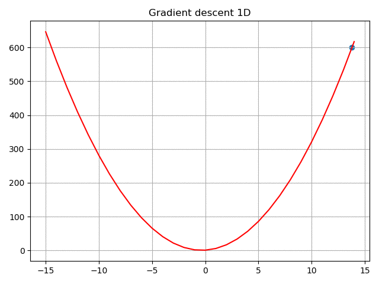
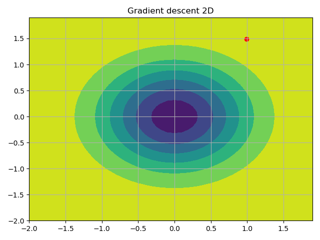
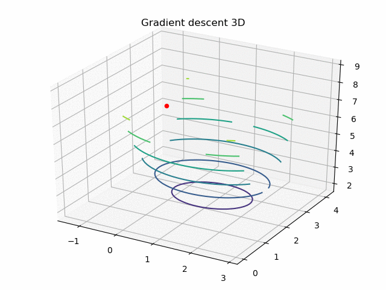

# Gradient Descent Visualisation

**gradient descent visualisation in 1D, 2D, and 3D**

#### Dependencies:

- make sure to install scipy, numpy and matplotlib.

### Gradient descent 1D:
```
$ python gradient_descent1d.py
```



### Gradient descent 2D:
```
$ python gradient_descent2d.py
```



### Gradient descent 3D:
```
$ python gradient_descent3d.py
```
